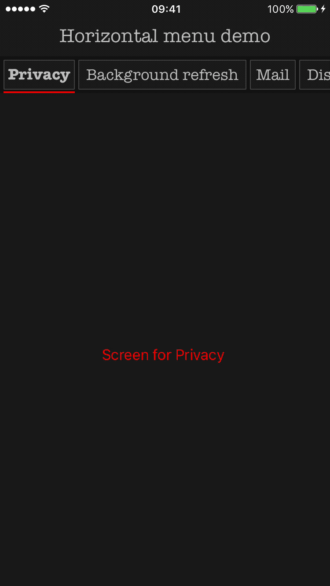

<div align="center" markdown="1">


</div>

[](https://github.com/Carthage/Carthage)
[](https://github.com/CocoaPods/CocoaPods)
[](https://swift.org)


## Description

- [x] UIKit like
- [x] Easy to use
- [x] Customizable
- [x] Automatic scrolling for menu items
- [x] Progressive transition and appeareance
- [x] Custom life cycle for view controllers associated with menu items

If you're using UIKit, you'll feel at home.
It's a UI component similar to UIPageViewController that helps you to create a menu designed for iOS with a dynamic number of items.

<div align="center" markdown="1">



</div>

## Table of contents

- [Installation](https://github.com/3pillarlabs/ios-horizontalmenu#installation)
	- [CocoaPods](https://github.com/3pillarlabs/ios-horizontalmenu#3-cocoapods)
	- [Carthage](https://github.com/3pillarlabs/ios-horizontalmenu#2-carthage)
- [Usage](https://github.com/3pillarlabs/ios-horizontalmenu#usage)
- [Tips](https://github.com/3pillarlabs/ios-horizontalmenu#tips)
- [Contribution](https://github.com/3pillarlabs/ios-horizontalmenu#contribution)
- [License](https://github.com/3pillarlabs/ios-horizontalmenu#license)

## Installation

Available in iOS 10.0 and later. 

CocoaPods Installation

- Run Terminal

- Navigate to project folder

- Use command:

```
pod init
```

- Add code to podfile

```
platform :ios, '10.0'

target 'YourProjectName' do
  use_frameworks!
    pod 'TPGHorizontalMenu'
end
```

- Run command:

```
pod install
```

Remember to open project using workspace

Carthage Installation

- Run Terminal

- Navigate to project folder

- Use command in terminal:
```
touch cartfile
```

- Add code to Cartfile:

```
github "3pillarlabs/ios-horizontalmenu"

```

- Run carthage by using command:

```
carthage update
```
- In order to link your app with the framework, you have to add the TPGHorizontalMenu in 'Embedded Binaries' list from 'General' section on application's target from Carthage/Build/iOS in project folder.


## Usage

How to use the framework:

- Import the framework

``` swift
import TPGHorizontalMenu
```

- Create an instance of menu view controller

``` swift
let menuViewController = HorizontalMenuViewController()        
menuViewController.dataSource = self // to populate the menu
menuViewController.layoutDelegate = self // to provide custom layout and alignment
```

- Add view controller as child to another view controller

``` swift
menuViewController.willMove(toParentViewController: self)
menuViewController.view.frame = view.bounds
view.addSubview(menuViewController.view)
addChildViewController(menuViewController)
```

In order to populate the menu you have to conform to data source protocol `HorizontalMenuViewControllerDataSource`:

``` swift
extension DataSourceImplemeter: HorizontalMenuViewControllerDataSource {
   ...
}
```

then:

- provide the number of items:

``` swift
func horizontalMenuViewControllerNumberOfItems(horizontalMenuViewController: HorizontalMenuViewController) -> Int {
    return array.count
}
```

- provide a menu item for an index:

``` swift
func horizontalMenuViewController(horizontalMenuViewController: HorizontalMenuViewController,
                                  menuItemFor index: Int) -> MenuItem {
    let title = array[index]
    return MenuItem(attributedTitle: title) // use the constructor you need
}
```

- provide the view controller associated with menu item:

``` swift
func horizontalMenuViewController(horizontalMenuViewController: HorizontalMenuViewController,
                                  viewControllerFor index: Int) -> UIViewController {
    let screen = UIViewController()
        
    // customize the screen
        
    return screen
}
```

and now you have the menu visible in your application.


## Tips

If you need to customize any kind of layout, you may do so by implementing `LayoutControllerDelegate`:

``` swift
extension DelegateType: LayoutControllerDelegate {
   ...
}
```


### 1. How to customize insets for all menu items?

Insets may be change through `MenuGeometry`.

``` swift
func layoutControllerMenuGeometry(layoutController: LayoutController) -> MenuGeometry {
    return MenuGeometry(itemsInset: UIEdgeInsets(top: 8.0, left: 12.0, bottom: 8.0, right: 12.0))
}
```

### 2. How to customize spacing between items?

Spacing between items may be change through `MenuGeometry`.

``` swift
func layoutControllerMenuGeometry(layoutController: LayoutController) -> MenuGeometry {
    return MenuGeometry(itemSpacing: 24.0)
}
```

### 3. How to customize the size of a menu item view?

The size of menu item can be change to be a fixed size or compute your size to be dependant on the data you want to display on menu item.

``` swift
// Fixed size
func layoutController(layoutController: LayoutController, geometryForItemAt index: Int) -> ItemGeometry {
    return ItemGeometry(size: CGSize(width: 60.0, height: 80.0))
}

// Dynamic size

func layoutController(layoutController: LayoutController, geometryForItemAt index: Int) -> ItemGeometry {
    let view = menuViewController.items[index].view
    let size = // compute size
    return ItemGeometry(size: size)
}

// If things are getting complicated

/// CustomItemGeometry.swift

class CustomItemGeometry: ItemGeometry {
    init(view: UIView) {
        let size = CustomItemGeometry.computeItemSize(for: view)
        super.init(size: size)
    }
    
    private static func computeItemSize(for view: UIView) -> CGSize {
        // additional work
        return CGSize()
    }
}

/// DelegateType.swift

func layoutController(layoutController: LayoutController, geometryForItemAt index: Int) -> ItemGeometry {
    let view = menuViewController.items[index].view
    return CustomItemGeometry(view: view)
}

```

### 4. How to customize height of scroll indicator view?

The height of scroll indicator view may be customized through `ScrollIndicatorGeometry`. An instance of `ScrollIndicatorGeometry` can provided as parameter to `MenuGeometry`.

``` swift
func layoutControllerMenuGeometry(layoutController: LayoutController) -> MenuGeometry {
    let scrollIndicatorGeometry = ScrollIndicatorGeometry(height: 10.0)
    return MenuGeometry(scrollIndicatorGeometry: scrollIndicatorGeometry)
}
```

### 5. How to set scroll indicator vertical alignment?

As we customize the height of scroll indicator view we can also change the alignment: `bottom` or `top`. The default is `bottom`.

``` swift
func layoutControllerMenuGeometry(layoutController: LayoutController) -> MenuGeometry {
    let scrollIndicatorGeometry = ScrollIndicatorGeometry(height: 12.0, verticalAlignment: .top)
    return MenuGeometry(scrollIndicatorGeometry: scrollIndicatorGeometry)
}

```

### 6. How to set menu item vertical alignment?

The vertical alignment of a menu item can be changed through geometry object. Possible values are:

- `top`
- `center` (default)
- `bottom`

Be aware that you might need to the set a preferred content height of menu.

``` swift
func layoutController(layoutController: LayoutController, geometryForItemAt index: Int) -> ItemGeometry {
    return ItemGeometry(size: CGSize(width: 60.0, height: 80.0), verticalAlignment: .bottom)
}
```

### 7. How to set preffered content height of menu?

Height of menu content may be set through `MenuGeometry`.

``` swift
func layoutControllerMenuGeometry(layoutController: LayoutController) -> MenuGeometry {
    return MenuGeometry(prefferedHeight: 60.0)
}

```

### 8. How to create a custom menu item with highlight and/or select state?

Highlighting and selection may be achieved by implementing `Highlightable` and `Selectable` by the view which is used on menu items. 

UIKit classes already implement these protocols, such as [UIControl](Sources/Highlightable.swift). Others may only implement `Highlightable`, such as [UILabel](Sources/Selectable.swift).

``` swift
class MenuItemView: UIView, Highlightable, Selectable {
   var isHighlighted: Bool {
      didSet {
         // update view for highlighted state
      }
   }
   
   var isSelected: Bool {
      didSet {
         // update view for selected state
      }
   }
}
```

### 9. How to use a custom menu item view?

MenuItem provides a default initializer which accepts an instance of UIView.

``` swift
func horizontalMenuViewController(horizontalMenuViewController: HorizontalMenuViewController,
                                  menuItemFor index: Int) -> MenuItem {
    let data = array[index]
    let view = MenuItemView()
    view.property = data.otherProperty
    return MenuItem(view: view)
}

```

### 10. How to use custom animation for selection?

In order to customize the animations you need to implement `HorizontalMenuViewControllerDelegate`.

``` swift
func horizontalMenuViewController(horizontalMenuViewController: HorizontalMenuViewController,
                                  animationForSelectionOf index: Int) -> Animation {
    return Animation(duration: 0.5) // customize animation as you need
}
```

### 11. How to use custom animation for appearance when user selects a menu item?

As we customize selection animation, we can do it for appearance as well when the current item is not visible and user swipes outside the boundaries (before first item and after the last item) of menu.

``` swift
func horizontalMenuViewControllerAnimationForEdgeAppearance(horizontalMenuViewController: HorizontalMenuViewController) -> Animation {
    return Animation(duration: 0.5) // customize animation as you need
}
```

### 12. How to update a screen progressively as user drags?

The view controller which is provided through `HorizontalMenuViewControllerDataSource` may implement `HorizontalMenuChild`. The functions from this protocol will be called when user swipes left or right in order to change the current item.

``` swift
class MenuScreenViewController: UIViewController, HorizontalMenuChild {
   func appearanceProgress(progress: CGFloat) {
      // implement logic when view controller appears progressively
   }
   
   func disappearanceProgress(progress: CGFloat) {
      // implement logic when view controller disappears progressively
   }
}
```

### 13. How to update other views synchronously with users' drag action?

`HorizontalMenuViewControllerDelegate` provides a callback with all information needed for progressive update. To simplify the computation with progress, the framework provide a data type (`Segment`) which can compute an intermediate value between 2 values and a given progress.

``` swift
func horizontalMenuViewController(horizontalMenuViewController: HorizontalMenuViewController,
                                  scrollTransition: ScrollTransition) {
   guard views.isValid(index: scrollTransition.toIndex),
         views.isValid(index: scrollTransition.fromIndex) else { return }
         
      let firstPoint = views[scrollTransition.fromIndex].frame.origin
      let secondPoint = views[scrollTransition.toIndex].frame.origin
      let segment = Segment<CGPoint>(first: firstPoint, second: secondPoint)
      viewProperty.frame.origin = segment.pointProgress(with: scrollTransition.progress)
   }
}
```

### 14. Why do not I receive calls of progressive transition when user selects an item?

When user selects an menu item, only 2 callbacks are provided:

- before animation starts;
- after animation finished;

If really you need callbacks, you may use CADisplayLink to provide callbacks for you.

An important thing to know is that default animations have a duration of 0.3 seconds.

Also if you feel the need for a small demo please check the demo project branch, add the framework and you are good to go.

## Contribution

Did you find a bug in the framework? Create an [issue](https://github.com/3pillarlabs/ios-horizontalmenu/issues).

Want to help us implement new features or fix bugs? Create a [pull request](https://github.com/3pillarlabs/ios-horizontalmenu/pulls).

## License

**Horizontal Menu** is released under MIT license. See [LICENSE](LICENSE) for details.

## About this project

[](http://www.3pillarglobal.com/)

**Horizontal Menu** is developed and maintained by [3Pillar Global](http://www.3pillarglobal.com/).